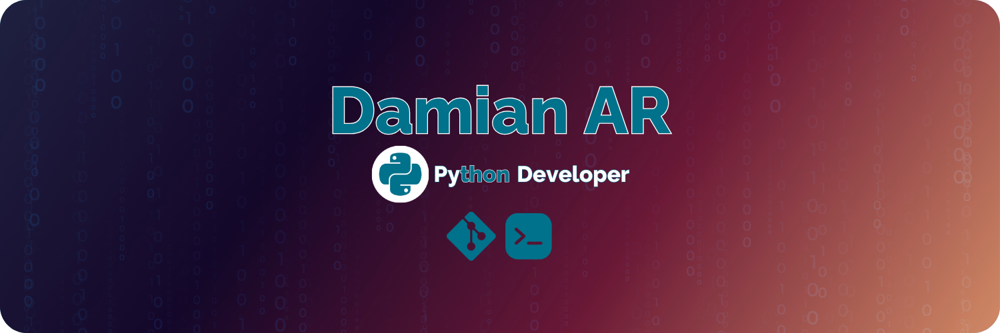

# 🇬🇧 Hi👋  this is Damian AR 😃

## Python Developer *"on the way to becomming Full-Stack"*

Hello, my name is Damián AR. I've been passionate about technology since I was very young and curious about how things work behind the screen. Today, I focus on creating software to provide solutions to people's problems.

 

### About me 🙋‍♂️

- Currently studying programming at Conquer Blocks Academy
- Passionate about Linux and open-source software
- Terminal enthusiast
- Current GNU/Linux distros: Ubuntu and Pop_OS
- Current stack:
  
    

### Contact me ✉️

# 🇪🇸 Hola👋 soy Damián AR😃

## Desarrollador Python *"camino a Full-Stack"*

Hola, mi nombre es Damián AR. Soy un apasionado de la tecnología desde muy pequeño y de entender cómo funciona lo que vemos a través de la pantalla. Hoy me dedico a crear software para dar una solución a los problemas de la gente.

 

### Sobre mí 🙋‍♂️
  - Actualmente estudiando programación en la Academia Conquer Blocks
  - Apasionado de Linux y el software de código abierto
  - Amante de la terminal
  - Distro actual GNU/Linux: Ubuntu y Pop_us
  - Stack actual: 
  
      

### Contáctame✉️

<!--
Here are some ideas to get you started:

- 🔭 I’m currently working on ...
- 🌱 I’m currently learning ...
- 👯 I’m looking to collaborate on ...
- 🤔 I’m looking for help with ...
- 💬 Ask me about ...
- 📫 How to reach me: ...
- 😄 Pronouns: ...
- ⚡ Fun fact: ...
-->
 